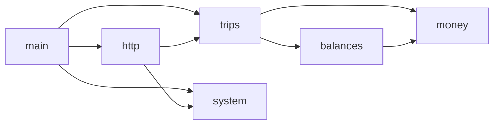
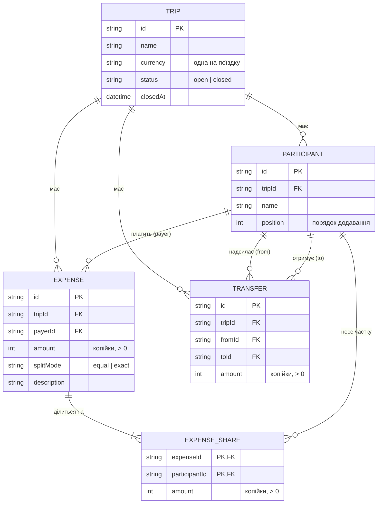

# Архітектура SplitTrip

Статус: прийнято · Вхід: [spec.md](spec.md), [spec-fix-02.md](spec-fix-02.md),
[spec-fix-03.md](spec-fix-03.md)

## 1. Як виведено межі модулів

Межі модулів проведено за межами узгодженості даних, а не за шарами фреймворку.

- Усі правила, що забороняють зміну, стосуються **поїздки загалом**: закрита поїздка не
  змінюється; учасника не можна прибрати, якщо він згаданий у витраті чи переказі; закрити
  можна лише за нульових балансів. Кожне з них читає учасників, витрати й перекази
  **разом**. Тому поїздка з учасниками, витратами й переказами — один агрегат і один
  модуль `trips` ([ADR-0013](../../adr/0013-trip-single-aggregate.md)). Якби витрати й
  перекази були окремими модулями, закриття поїздки вимагало б балансів, баланси — витрат, а
  витрати — перевірки статусу поїздки: цикл `trips → balances → expenses → trips`.
- **Обчислення** балансів і пропонованих переказів не залежить від того, як поїздка
  зберігається й змінюється, — це чиста функція від витрат і переказів. Воно винесене в
  `balances`: його можна тестувати окремо, а `trips` лише викликає.
- **Гроші** (ціла кількість копійок, поділ суми на частки без втрат) потрібні і `trips`
  (поділ порівну), і `balances` (сума балансів). Це окремий модуль `money` без залежностей.
- **HTTP** і **системна інформація** (`/health`, `/version`) — не домен. Вони винесені в
  адаптери, щоб домен не залежав від Fastify, git і процесу.

## 2. Модулі

| Модуль | Тип | Відповідальність | Публічний вхід |
|---|---|---|---|
| `money` | домен | Тип `Money` (цілі копійки), додавання/віднімання, `allocateEqually` | `src/modules/money/index.ts` |
| `balances` | домен | `computeBalances(expenses, transfers)`, `suggestTransfers(balances)` | `src/modules/balances/index.ts` |
| `trips` | домен | Агрегат поїздки, сценарії (use cases), порт сховища `TripRepository` | `src/modules/trips/index.ts` |
| `system` | адаптер | Стан і версія застосунку (`APP_VERSION` → `git rev-parse HEAD` → `unknown`) | `src/modules/system/index.ts` |
| `http` | адаптер | Fastify-сервер, маршрути, відображення помилок домену в HTTP-коди | `src/modules/http/index.ts` |

`src/main.ts` — точка складання (composition root): створює залежності й запускає сервер.
Сховище в лабі 1 поза обсягом; з лаби 2 з'явиться адаптер, що реалізує `TripRepository`.

## 3. Взаємодія і правила залежностей



Правила (перевіряє dependency-cruiser, [ADR-0006](../../adr/0006-dependency-cruiser-boundaries.md)):

1. Дозволені лише стрілки з графа вище; будь-яка інша залежність між модулями — помилка.
2. Імпорт іншого модуля — лише через його `index.ts`; внутрішні файли недоступні ззовні.
3. Циклів немає — ні між модулями, ні всередині модуля.
4. Доменні модулі (`money`, `balances`, `trips`) не імпортують `fastify`, `node:*` та інші
   зовнішні пакети — лише один одного за графом.
5. `fastify` імпортує лише `http`; `node:child_process` — лише `system`.
6. Ніхто не імпортує `main.ts`.

## 4. Дані й зв'язки



- Частки (`EXPENSE_SHARE`) зберігаються для обох способів поділу; при поділі порівну їх
  обчислює `money.allocateEqually` у момент запису (spec-fix-03, п. 2;
  [ADR-0010](../../adr/0010-equal-split-rounding.md)).
- Баланси й пропоновані перекази **не зберігаються** — обчислюються з витрат і переказів
  ([ADR-0012](../../adr/0012-derived-balances.md)).
- `position` — порядок додавання учасника; задає, хто отримує залишкові копійки.

**Інваріанти**

- I1. Для кожної витрати Σ часток = сума витрати.
- I2. Сума балансів поїздки = 0 (випливає з I1: перекази входять у баланси з обома знаками).
- I3. Платник, учасники поділу, відправник і отримувач переказу — учасники тієї ж поїздки.
- I4. Закрита поїздка не змінюється; закриття незворотне.
- I5. Учасник, згаданий у витраті чи переказі, не видаляється.
- I6. Усі суми — цілі додатні копійки (баланси можуть бути від'ємними).

## 5. Зміна даних за сценаріями

Кожен сценарій, що змінює дані, спершу перевіряє, що поїздка існує і має статус `open` (I4).

| # | Сценарій | Перевірки | Зміна даних |
|---|---|---|---|
| 1 | Створити поїздку | назва непорожня, код валюти | + `TRIP(status=open)` |
| 2 | Додати учасника | open; ім'я непорожнє | + `PARTICIPANT(position = max + 1)` |
| 3 | Прибрати учасника | open; I5 | − `PARTICIPANT` |
| 4 | Записати витрату | open; сума > 0; I3; для `exact` — кожна частка > 0 і I1 | + `EXPENSE`, + `EXPENSE_SHARE` × n (для `equal` — `allocateEqually`) |
| 5 | Змінити витрату | ті самі, що в 4 | `EXPENSE` оновлено; усі її `EXPENSE_SHARE` замінено новими — атомарно |
| 6 | Видалити витрату | open | − `EXPENSE` і всі її `EXPENSE_SHARE` |
| 7 | Переглянути баланси | — | немає; `balance(p) = Σ EXPENSE.amount(payer = p) − Σ EXPENSE_SHARE.amount(p) + Σ TRANSFER.amount(from = p) − Σ TRANSFER.amount(to = p)` |
| 8 | Запропоновані перекази | — | немає; жадібний алгоритм над балансами ([ADR-0011](../../adr/0011-greedy-settlement.md)) |
| 9 | Зафіксувати переказ | open; сума > 0; від ≠ кому; I3 | + `TRANSFER` |
| 10 | Видалити переказ (spec-fix-03, п. 5) | open | − `TRANSFER` |
| 11 | Закрити поїздку | open; баланс кожного = 0 | `TRIP.status = closed`, `closedAt = now` |

## 6. Структура коду

```
src/
  main.ts                 # composition root
  modules/
    money/index.ts
    balances/index.ts
    trips/index.ts
    system/index.ts
    http/index.ts
scripts/                  # власні перевірки C3, C4, C9
test/smoke/               # smoke-тест зібраного застосунку
```
